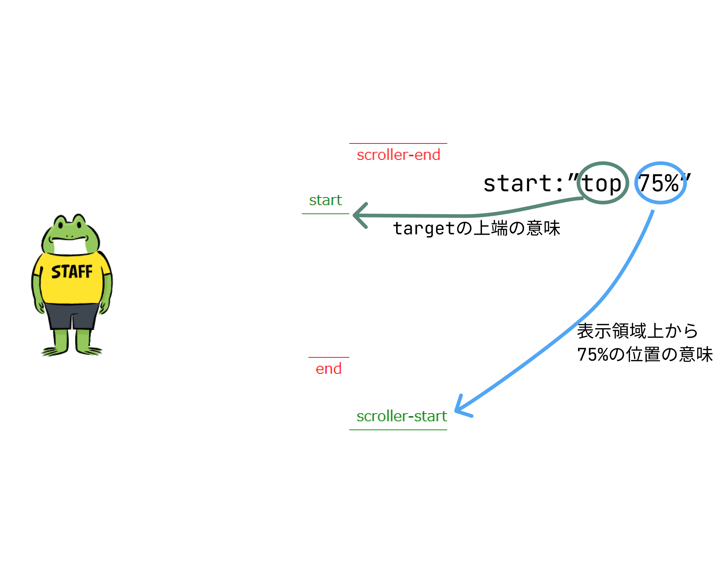

import { LinkCard, CardGrid } from '@astrojs/starlight/components';

ScrollTriggerは、特定の要素が画面内に入ったらTweenの再生を開始したい、というようなときに使えるプラグイン。

## 基本の使い方
Tweenに対してScrollTriggerをつけたいときはvarsオブジェクトの中にscrollTriggerを指定し、その中に記述を書く。

### Tweenに対してなら
```js
gsap.from(".target",{
  duration:3,x:"-50vw",rotation:-360,ease:"linear",
  scrollTrigger: {
    trigger:".scroll-target",
    start:"top 75%",
    end:"bottom 25%",
    markers:true //スクロール位置確認用
  }
})
```

### Timelineに対してなら
```js
gsap.timeline({scrollTrigger:{
	trigger:".scroll-target",
	start:"top 50%",
	end:"bottom 50%",
	markers:true //スクロール位置確認用
}})
.to("#one",{duration:2, x:500})
.to("#two",{duration:1, x:500})
.to("#three",{duration:1, x:500})
```

## `start` `end` の設定値の説明
`markers:true` に設定しておくと開発用のスクロール位置確認マーカーが表示される。
`start`と`end`の値はそれぞれ`""`内で2つの値を設定するようになっている。
<dl>
    <dt>左側の値</dt>
    <dd>start end マーカーの位置を、`trigger`で指定した要素のどこに置くか。</dd>
    <dd>`top` `bottom` 以外に`center`もあるし`100px`とかもできる</dd>
    <dt>右側の値</dt>
    <dd>scroller-start scroller-end マーカーの位置を画面表示領域内の上からどこに置くか。</dd>
    <dd>`25%`なら表示領域の上から25%だし、`100px`のような指定もできる</dd>
</dl>




### `endTrigger`で `end` の計算に使う要素を変える
例えばページをスクロールし始めた瞬間をstartとして(bodyの"top top")、
特定の要素の下端が画面に描画されたらendとする(.othersの"bottom bottom")
```js
  trigger:"body",
  endTrigger:".others",
  start:"top top",
  end:"bottom bottom",
```

## `.create()` を使ったScrollTriggerの応用
tweenやtimelineを`ScrollTrigger.create()`を使って動作させることもできる。
※tweenとしている部分は、timelineでも同様に動作する

### `animation`を使う場合
```js
const tween = gsap.to(".animation-target",{scaleX:1, paused:true});

ScrollTrigger.create({
  trigger:".scroll-target",
  start:"top 50%",
  end:"bottom 50%",
  animation:tween
})
```

### `onUpdate()` を使う場合
以下の`self.progress` にはstartを0、endを1として現在の進捗状況が入っており、
その数値を `tween.progress()` に渡すことでアニメーションを再生させられる。

```js
const tween = gsap.to(".animation-target",{scaleX:1, paused:true});

ScrollTrigger.create({
  trigger:".scroll-target",
  start:"top 50%",
  end:"bottom 50%",
  onUpdate:(self)=>{
    tween.progress(self.progress);
  }
})
```


